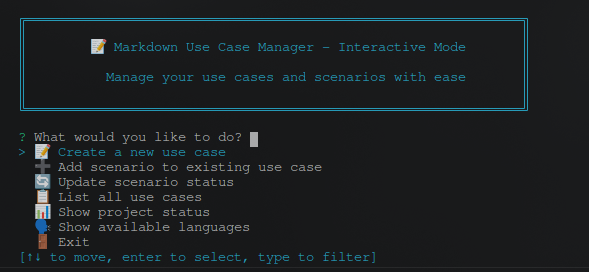

<div align="center">
  
</div>

## Why This Tool?

Most use case management happens in external tools like Jira or Confluence, which creates a disconnect between your documentation and code. This tool keeps everything together in your repository as plain markdown files.

Your use cases live alongside your code, version-controlled and readable by anyone. No external dependencies, no cloud services, no vendor lock-in. Just markdown files that work with any static site generator or documentation platform.

Works great for solo developers, small teams, or any project where you want documentation that travels with your code.

## Key Features

### Modular Template System
- **Dynamic methodology templates** - Choose between Developer, Tester, Business, and Feature-focused approaches
- **Language-specific test generation** - Python, Rust, and JavaScript support with customizable test templates
- **Fully customizable templates** - Modify Handlebars templates to match your team's needs
- **Mix and match** - Different methodologies for different use case categories

### Dual Storage Backends

**TOML (Default)**
- Human-readable source of truth that lives in your repository
- View and edit directly in GitHub/GitLab without special tools
- Perfect for code review and version control
- Ideal for small to medium projects (< 100 use cases)
- Manual editing friendly

**SQLite**
- High-performance database for large projects (100+ use cases)
- Complex queries and relationship tracking
- Transaction support for data integrity
- CLI-driven workflow (not manually editable)
- Not easily viewable on GitHub/GitLab web interface

### Flexible Workflow
- **Interactive mode** - Guided workflows with smart suggestions and auto-completion
- **Script mode** - Automation-friendly for CI/CD pipelines
- **Field management** - Add, list, and remove preconditions, postconditions, and use case references
- **Both modes available** - Choose based on your context

### Professional Documentation
- **Extended metadata** - Personas, prerequisites, business value, acceptance criteria
- **Use case dependencies** - Reference and link related use cases
- **Status tracking** - Progress from planning to deployment with automatic rollup
- **Markdown export** - Works with any static site generator or documentation platform

## Getting Started

### System Installation

```bash
git clone https://github.com/GuillaumeCoi/markdown-use-case-manager
cd markdown-use-case-manager
cargo install --path .            # Don't forget the dot at the end
```

Now you can run the tool with `mucm` from anywhere.

### Interactive Mode

For the best user experience, use interactive mode:

```bash
mucm -i                          # Start interactive mode
```

When you run `mucm -i` without an existing project, it launches a project initialization wizard that guides you through language selection, methodology choices (Developer, Tester, Business, Feature), and storage backend configuration (TOML or SQLite). Once initialized, interactive mode provides menu-driven access to all mucm commands.

### Basic Usage

#### Interactive Mode (Recommended)

```bash
# Launch interactive mode
mucm interactive               # or mucm -i
```



#### Script Mode (Perfect for Automation)

```bash
# Initialize your project (REQUIRED FIRST STEP)
mucm init                        # Uses TOML storage (default)
# or
mucm init --backend sqlite       # Uses SQLite for larger projects

# Create your first use case  
mucm create "User Login" --category "Security"

# View your documentation
mucm list
mucm status
```

### Field Management

Manage use case preconditions, postconditions, and references:

```bash
# Preconditions
mucm precondition add UC-SEC-001 "User must be authenticated"
mucm precondition list UC-SEC-001
mucm precondition remove UC-SEC-001 1

# Postconditions  
mucm postcondition add UC-SEC-001 "User session is established"
mucm postcondition list UC-SEC-001
mucm postcondition remove UC-SEC-001 1

# Use case references
mucm reference add UC-SEC-001 UC-AUTH-001 dependency "Requires authentication"
mucm reference list UC-SEC-001
mucm reference remove UC-SEC-001 UC-AUTH-001
```

> **Note**: Some commands have changed. Use `mucm --help` or `mucm <command> --help` for current options.

> **⚠️ Important**: You **must** run `mucm init` before using any other commands.

### What You Get

Creating use cases generates a clean file structure:

```
docs/use-cases/
├── README.md                    # Auto-generated overview
├── security/
│   └── UC-SEC-001.md           # Individual use case 
└── ...

tests/use-cases/
├── security/
│   └── uc_sec_001.rs           # Test scaffolding 
└── ...
```

Everything is standard markdown with YAML frontmatter, so it works with any static site generator.

## Status Tracking

Six development statuses that automatically roll up from scenarios to use cases:

```
PLANNED 📋      → Basic idea documented
IN_PROGRESS 🔄  → Development started
IMPLEMENTED ⚡  → Code complete, not tested
TESTED ✅       → Tested and verified
DEPLOYED 🚀     → Live in production
DEPRECATED ⚠️   → No longer maintained
```

The use case status automatically reflects the minimum status of all its scenarios.

## Extended Metadata

Rich metadata support for professional documentation:

### **Available Fields**
- **👥 Personas** - Target users and stakeholders
- **📋 Prerequisites** - System requirements and dependencies  
- **🔗 Preconditions** - Conditions that must be true before use case execution
- **✅ Postconditions** - Conditions that will be true after successful completion
- **🔗 Use Case References** - Relationships to other use cases (dependencies, extensions, etc.)
- **✍️ Author/Reviewer** - Ownership and review information
- **💰 Business Value** - Why this use case matters
- **🔧 Complexity** - Implementation difficulty assessment
- **📦 Epic** - Project/epic association
- **✅ Acceptance Criteria** - Definition of "done"
- **💭 Assumptions & ⚠️ Constraints** - Context and limitations

### **Use Case Dependencies**
Reference related use cases in prerequisites:
```markdown
## Prerequisites
- User must be logged in (UC-AUTH-001)
- Payment method configured (UC-PAY-003)
- Shopping cart not empty (UC-CART-002)
```

### **Professional Output**
```markdown
# UC-AUTH-001: User Authentication

**Author:** John Doe | **Reviewer:** Jane Smith
**Target Users:** Customer, Admin User

## Business Value
Secure authentication improves user trust and reduces support tickets

## Prerequisites
- System is online
- User registration completed (UC-REG-001)

## Acceptance Criteria
- Login completes within 5 seconds
- Multi-factor authentication supported
```

## Template Methodologies

Choose from four dynamic template methodologies, each optimized for different team focuses:

### Developer
**Best for**: Engineering teams, technical implementation focus
```bash
mucm init --methodology developer
```

### Tester
**Best for**: QA teams, test-driven development, quality assurance
```bash
mucm init --methodology tester
```

### Business
**Best for**: Product managers, stakeholder communication, business requirements
```bash
mucm init --methodology business
```

### Feature
**Best for**: Feature teams, user story focus, agile workflows
```bash
mucm init --methodology feature
```

Each methodology provides:
- **Methodology-specific templates** optimized for different team perspectives
- **Tailored configurations** with recommended settings
- **Language-specific test templates** (Python, Rust, JavaScript)
- **Fully customizable** - modify Handlebars templates to match your needs

## Configuration

The tool automatically creates configurations based on your choices:

```toml
[project]
name = "My Project"
description = "Project managed with Markdown Use Case Manager"

[templates]
methodology = "developer"             # developer, tester, business, or feature
use_extended_metadata = true          # Extended fields support
persona_template_enabled = true       # Persona templates

[storage]
backend = "toml"                      # toml (default) or sqlite
database_path = ".config/mucm/usecases.db"  # SQLite location (when using sqlite)

[directories]
use_case_dir = "docs/use-cases"
test_dir = "tests/use-cases"

[generation]
test_language = "rust"                # rust, python, javascript, or none
auto_generate_tests = true
```

## Template System

All templates are organized by methodology and fully customizable:

```
source-templates/methodologies/
├── developer/       # Engineering focus
├── tester/          # QA and testing focus
├── business/        # Business analysis
└── feature/         # Feature/user story focus
```

Each methodology includes:
- Use case templates with different detail levels (`uc_simple.hbs`, `uc_normal.hbs`, `uc_detailed.hbs`)
- Methodology-specific configurations
- Custom field support

Plus language-specific test templates:
```
source-templates/languages/
├── python/          # Python test templates
├── rust/            # Rust test templates
└── javascript/      # JavaScript test templates
```

## Deployment

Since everything is just markdown, your documentation works everywhere:

- **GitHub/GitLab Pages** - Automatic deployment from your repo
- **MkDocs** - `mkdocs serve` for instant documentation sites  
- **Docusaurus** - Modern documentation platform
- **Jekyll** - GitHub's default static site generator
- **Hugo** - Fast static site generator
- **Any markdown processor** - Pandoc, GitBook, etc.

## Development

### Running Tests

The test suite includes integration tests that modify global state (current working directory).
For best results, use **cargo nextest** which provides superior test isolation:

```bash
# Install nextest (one time)
cargo install cargo-nextest

# Run tests with nextest (recommended)
cargo nextest run

# Alternative: run with standard test runner
cargo test --lib

# If tests fail with cargo test, run modules individually:
cargo test --lib controller::tests::use_case_controller_tests
cargo test --lib controller::tests::project_controller_tests
cargo test --lib cli::interactive::tests
```

All tests are marked with `#[serial]` to run sequentially and avoid race conditions.
Nextest handles test isolation more effectively than the standard test runner.

## Contributing

Issues and pull requests welcome!

## License

MIT License - see [LICENSE](LICENSE) for details.